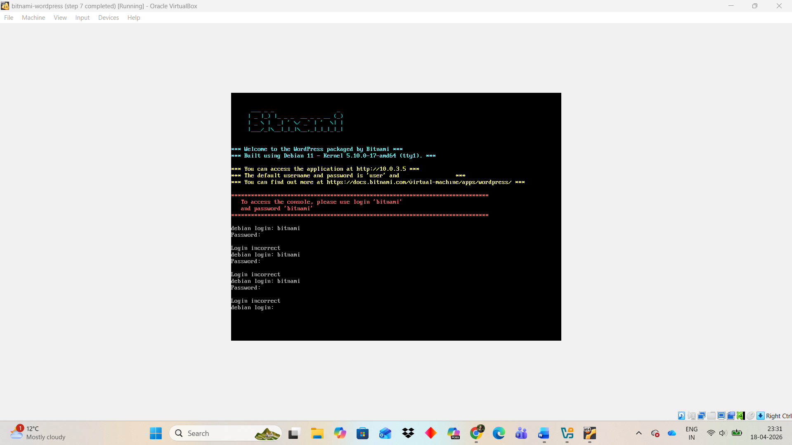
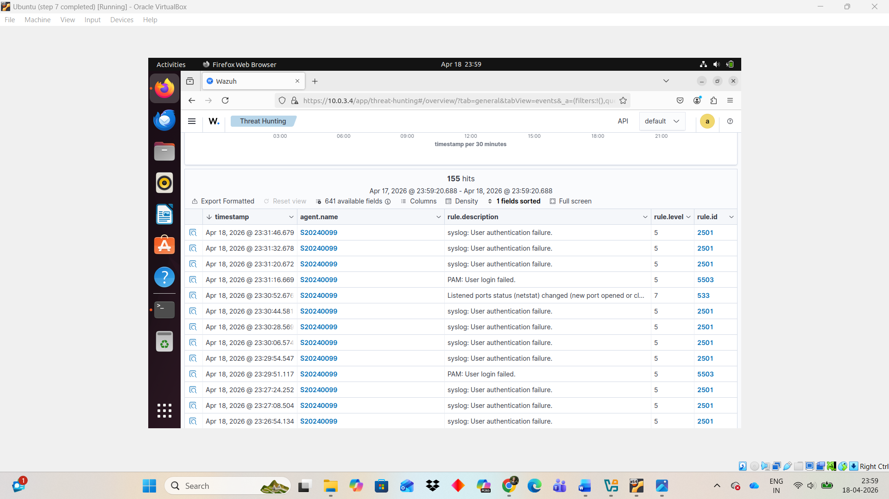
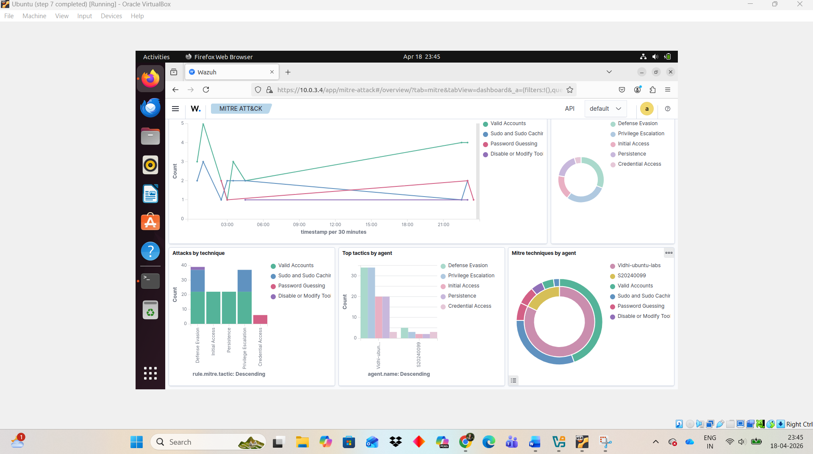
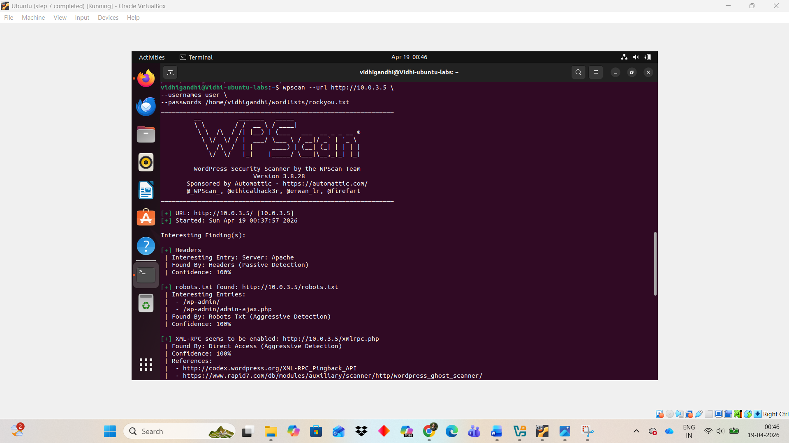
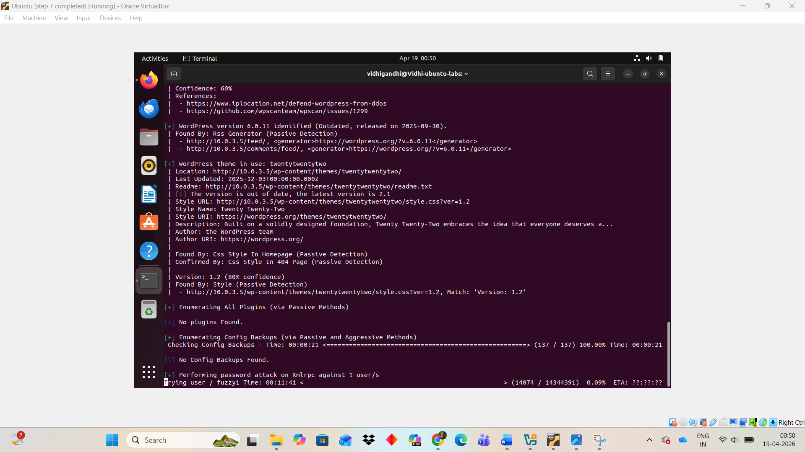
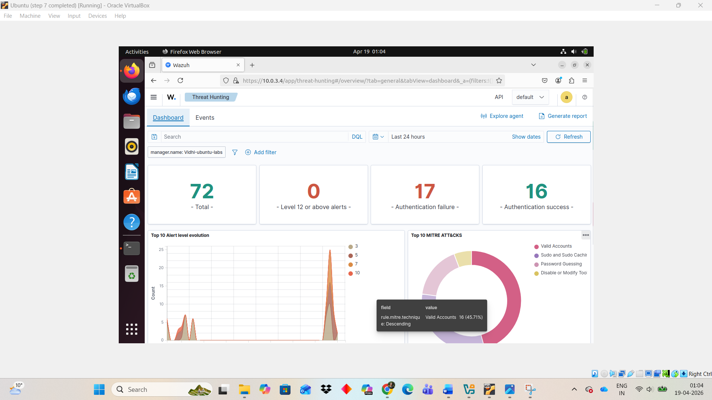
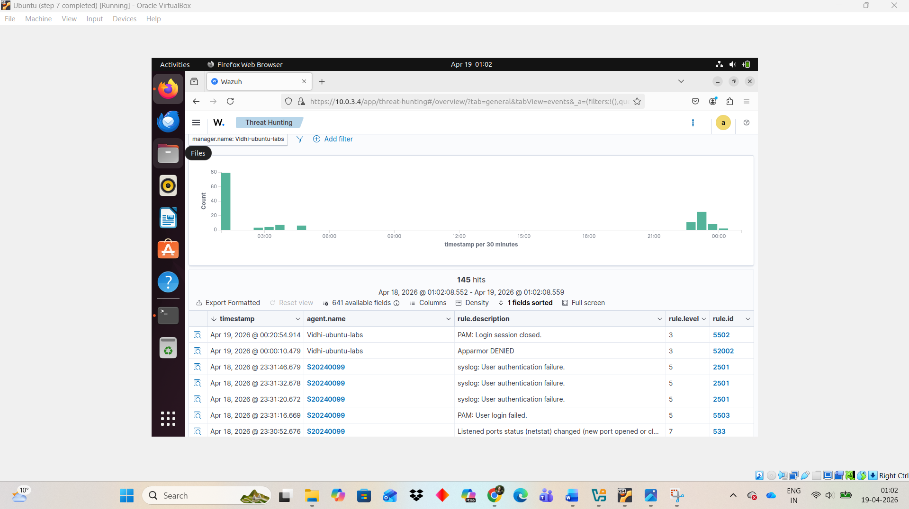

# Detection

This section documents the detection capabilities implemented in the Wazuh SOC/SIEM Home Lab.  
It covers system‑level authentication monitoring, password guessing attack simulation, application‑layer brute‑force attempts, and the resulting detections (or gaps) observed in Wazuh.

The goal of this module is to demonstrate how Wazuh processes log data, correlates events, and maps suspicious activity to MITRE ATT&CK techniques.

---

## 1. System Authentication Monitoring

Wazuh continuously monitors authentication activity on the Bitnami WordPress VM through the Wazuh agent.  
This includes failed logins, invalid credentials, and other OS‑level authentication events.

### Failed Login Attempts (Bitnami VM)

These events originate from `/var/log/auth.log` and are forwarded to the Wazuh Manager for analysis.

---

## 2. Password Guessing Attack Simulation

To evaluate Wazuh’s ability to detect credential‑based attacks, multiple incorrect username/password combinations were intentionally entered in rapid succession.

### Detection in Wazuh Threat Hunting

Wazuh successfully identified:

- Repeated authentication failures  
- Multiple invalid login attempts  
- Suspicious credential‑based activity  

These events were correlated and flagged as potential password guessing behavior.

---

## 3. MITRE ATT&CK Mapping

Wazuh mapped the repeated authentication failures to:

- **Technique:** Password Guessing  
- **Tactic:** Credential Access  

### MITRE Classification

This mapping provides standardized threat context and aligns the detection with known adversary techniques.

---

## 4. WPScan Brute‑Force Attack (Application Layer)

A WordPress brute‑force attack was performed using WPScan against:
http://10.0.3.5/wp-login.php

---

### WPScan Attack Execution

### WPScan Progress

WPScan attempted multiple password combinations using a wordlist, simulating a real‑world brute‑force attack on the WordPress login page.

---

## 5. Detection Gap: Application‑Layer Attacks

Wazuh did **not** generate specific alerts for the WPScan brute‑force activity.

### Wazuh Detection Gap

Wazuh successfully detected OS‑level authentication failures, but **did not flag the WPScan WordPress brute‑force attempts**, because:

- WordPress login attempts are logged in **Apache access/error logs**
- These logs were **not yet integrated** into Wazuh
- Wazuh’s default rules do **not** monitor application‑layer authentication by default
 

This demonstrates the importance of adding:

- Apache log ingestion  
- Custom rules  
- Application‑layer monitoring  

These enhancements will be implemented in future stages.

---

## 6. Summary

This detection module demonstrates:

### ✔ Successful detection of OS‑level authentication failures  
### ✔ Clear correlation of repeated failed logins  
### ✔ Automatic MITRE ATT&CK mapping to Password Guessing  
### ✔ Execution of a real brute‑force attack using WPScan  
### ✔ Identification of a detection gap for application‑layer attacks  
### ✔ Foundation for future detection engineering and log integration  

This folder represents the core detection capabilities of the SOC/SIEM environment and sets the stage for deeper investigations and custom rule development.

