# Lab Setup

This section documents the implementation of the Wazuh SOC/SIEM home lab, including the isolated virtual network, Wazuh server, monitored WordPress endpoint, Wazuh Agent deployment, and connectivity validation.

The environment was built using VirtualBox to provide a controlled laboratory environment for security monitoring and controlled attack simulation.

---

## 1. Lab Environment

The lab consists of two virtual machines connected through a VirtualBox NAT Network.

| Component              | Role                                           | IP Address    |
| ---------------------- | ---------------------------------------------- | ------------- |
| Ubuntu VM              | Wazuh security monitoring server               | `10.0.3.4`    |
| Bitnami WordPress VM   | Monitored endpoint and security testing target | `10.0.3.5`    |
| VirtualBox NAT Network | Isolated communication network                 | `10.0.3.0/24` |

### Network Layout

```text
                    VirtualBox NAT Network
                         10.0.3.0/24
                              |
                +-------------+-------------+
                |                           |
                |                           |
          Ubuntu VM                  Bitnami WordPress VM
          10.0.3.4                       10.0.3.5
                |                           |
         Wazuh Stack                    Wazuh Agent
                |                           |
                +------ Security Events ----+
```

---

## 2. VirtualBox NAT Network

An isolated VirtualBox NAT Network was configured using the `10.0.3.0/24` address range.

The network provides communication between the Wazuh server and the monitored WordPress endpoint within the controlled lab environment.

### Network Configuration

* **Network type:** VirtualBox NAT Network
* **Network range:** `10.0.3.0/24`
* **Ubuntu VM:** `10.0.3.4`
* **Bitnami WordPress VM:** `10.0.3.5`

**VirtualBox NAT Network configuration**

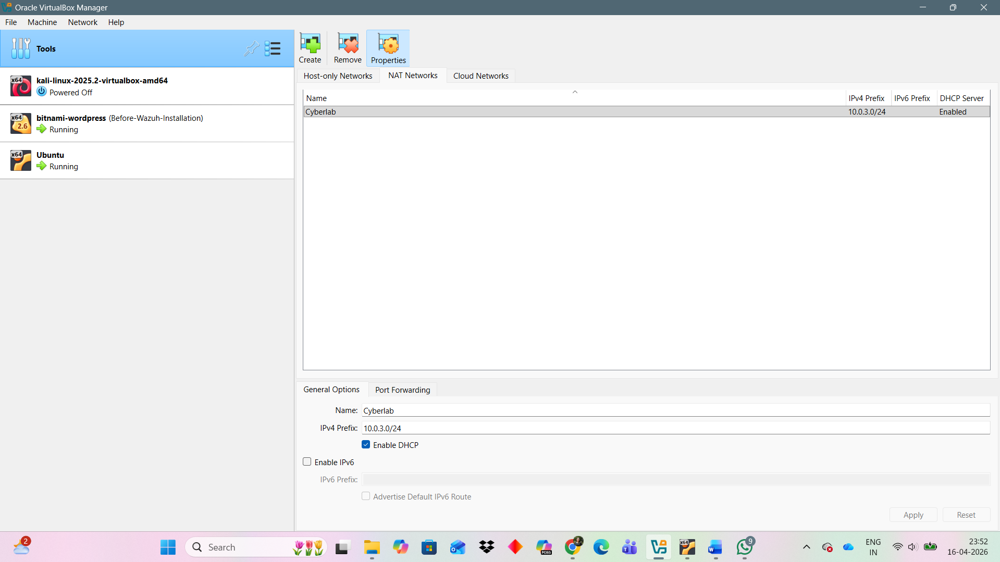

---

## 3. Ubuntu VM — Wazuh Server

The Ubuntu virtual machine was configured as the central security monitoring system for the lab.

### VM Resources

* **CPU:** 2 vCPU
* **Memory:** 4 GB RAM
* **Storage:** 50 GB
* **Network:** VirtualBox NAT Network
* **IP Address:** `10.0.3.4`

The Ubuntu VM hosts the Wazuh security monitoring stack used throughout the lab.

### Network Configuration

The Ubuntu VM was connected to the previously configured NAT Network.

**Ubuntu VM network configuration**

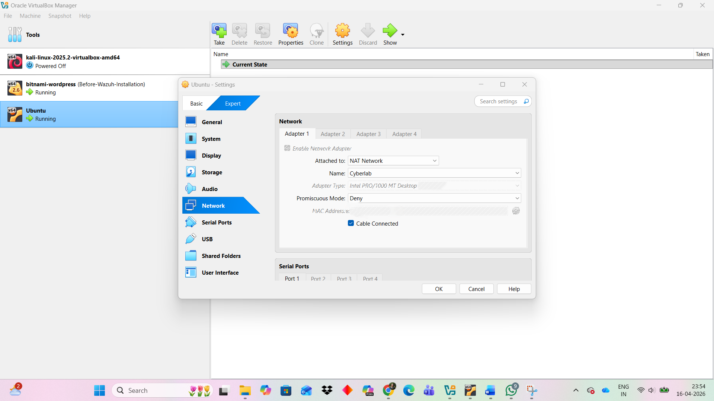

### IP Address Verification

The Ubuntu IP address was verified using:

```bash
ip a
```

The configured lab address was:

```text
10.0.3.4
```

**Ubuntu VM IP address**

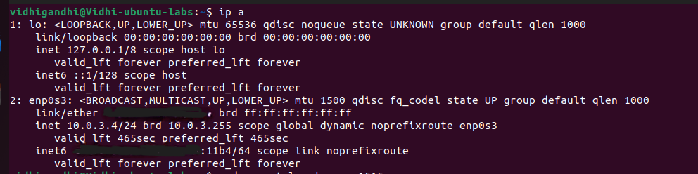

---

## 4. Bitnami WordPress VM — Monitored Endpoint

A Bitnami WordPress virtual machine was configured as the monitored endpoint and controlled security-testing target.

The VM was connected to the same VirtualBox NAT Network as the Ubuntu Wazuh server.

### Network Configuration

**Bitnami WordPress VM network configuration**

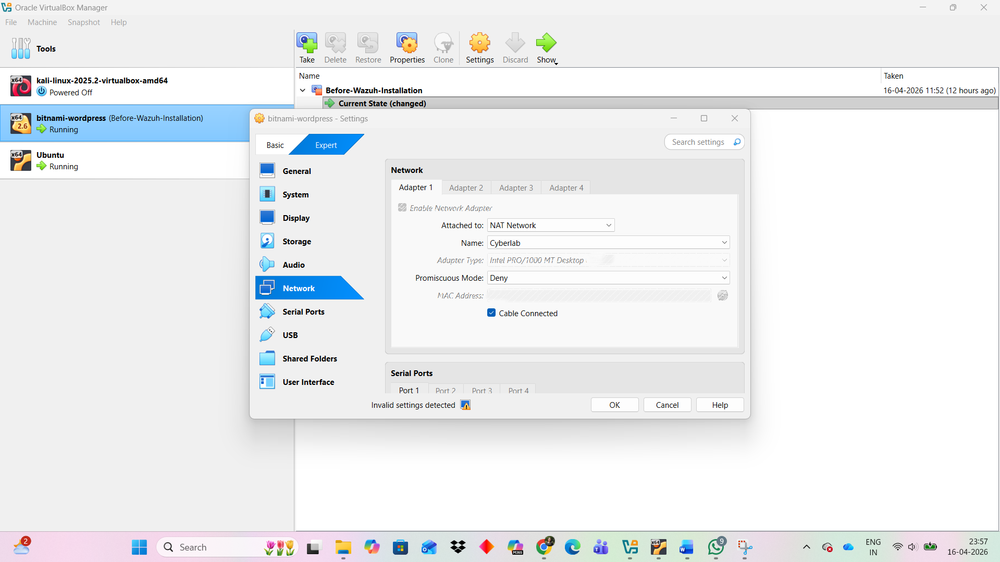

### IP Address Verification

The Bitnami VM IP address was verified using:

```bash
hostname -I
```

The configured lab address was:

```text
10.0.3.5
```

**Bitnami WordPress VM IP address**

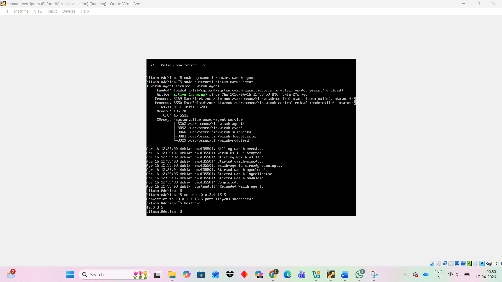

The Bitnami VM was subsequently used for:

* Endpoint monitoring through the Wazuh Agent
* System-level authentication testing
* Controlled WordPress security testing using WPScan

---

## 5. Wazuh Installation

The Wazuh security monitoring stack was installed on the Ubuntu VM using the all-in-one installation method.

The installation script was downloaded and executed with:

```bash
curl -sO https://packages.wazuh.com/4.14/wazuh-install.sh
sudo bash wazuh-install.sh -a
```

The all-in-one installation deployed the required Wazuh components on the Ubuntu VM.

### Installation Result

The installation completed successfully, providing the monitoring infrastructure used for:

* Security event collection
* Endpoint monitoring
* Alert generation
* Threat Hunting
* Vulnerability monitoring
* Security investigation

**Wazuh installation completion**

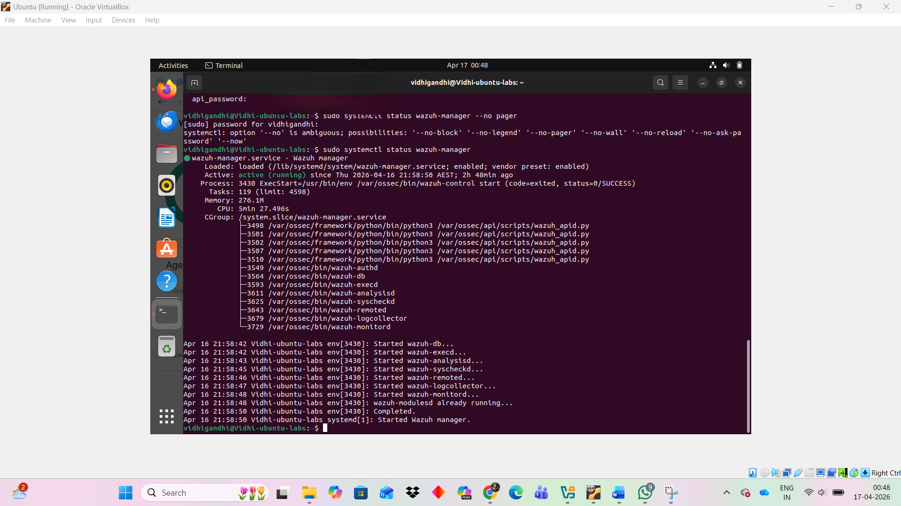

---

## 6. Wazuh Dashboard

After completing the Wazuh installation, the Wazuh Dashboard was accessed through:

```text
https://10.0.3.4
```

The dashboard provides the interface used to monitor the connected endpoint, review security events, investigate alerts, and perform vulnerability and threat analysis.

### Dashboard Access

The Wazuh Dashboard was successfully accessed from the Ubuntu Wazuh server.

**Dashboard login:**

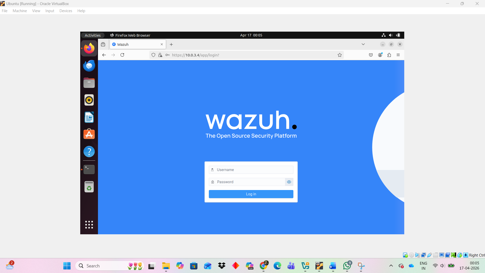

**Wazuh Dashboard:**

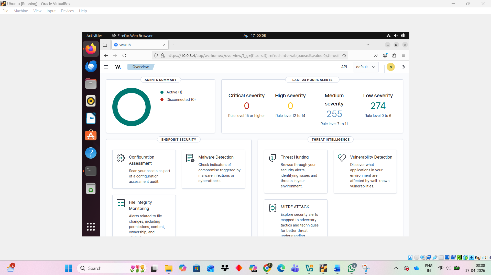

Authentication credentials and other sensitive information are not included in the public repository.

---

## 7. Wazuh Agent Installation

The Bitnami WordPress VM was configured with the Wazuh Agent so that endpoint security events could be collected by the Wazuh Manager.

The agent was configured to communicate with the Wazuh Manager at:

```text
10.0.3.4
```

The agent installation command used in the lab was:

```bash
sudo WAZUH_MANAGER='10.0.3.4' WAZUH_AGENT_NAME='S20240099' dpkg -i wazuh-agent.deb
```

The installation completed successfully and prepared the Bitnami endpoint for registration with the Wazuh Manager.

**Wazuh Agent installation**

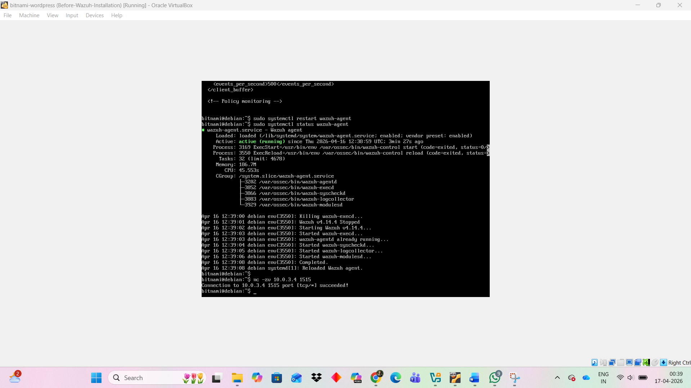

---

## 8. Agent Registration

After installation, the Wazuh Agent was registered with the Wazuh Manager.

The following command was executed on the Bitnami endpoint:

```bash
sudo /var/ossec/bin/agent-auth -m 10.0.3.4 -A S20240099
```

This established the agent's registration with the Wazuh Manager.

---

## 9. Agent Connection Verification

The registered agents were checked from the Ubuntu Wazuh server using:

```bash
sudo /var/ossec/bin/agent_control -l
```

The Bitnami WordPress agent appeared in an **ACTIVE** state.

This confirmed that:

* The Wazuh Agent was installed successfully.
* The agent was registered with the Wazuh Manager.
* Communication between the endpoint and Wazuh server was established.
* The endpoint was ready for security monitoring.

**Agent registration verification**

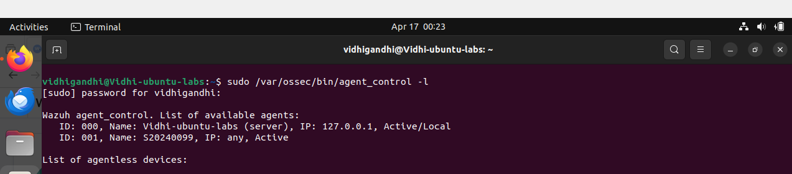

The same agent was also visible through the Wazuh Dashboard.

**Active agent in Wazuh Dashboard**

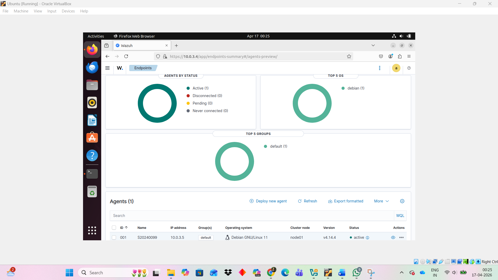

---

## 10. Initial Monitoring Validation

With the Wazuh Agent successfully connected, the Bitnami WordPress VM became a monitored endpoint within the SOC/SIEM environment.

The completed setup established the following monitoring flow:

```text
VirtualBox NAT Network
        ↓
Ubuntu Wazuh Server
        ↓
Wazuh Manager
        ↓
Wazuh Agent
        ↓
Bitnami WordPress Endpoint
        ↓
Security Events
        ↓
Wazuh Dashboard
        ↓
Detection & Investigation
```

This setup provided the foundation for the subsequent detection and security-testing stages of the project.

---

## Setup Validation

| Validation                        | Status    |
| --------------------------------- | --------- |
| VirtualBox NAT Network configured | Completed |
| Ubuntu VM configured              | Completed |
| Ubuntu IP verified (`10.0.3.4`)   | Completed |
| Bitnami WordPress VM configured   | Completed |
| Bitnami IP verified (`10.0.3.5`)  | Completed |
| Wazuh installed                   | Completed |
| Wazuh Dashboard accessible        | Completed |
| Wazuh Agent installed             | Completed |
| Wazuh Agent registered            | Completed |
| Agent communication verified      | Completed |
| Agent displayed as ACTIVE         | Completed |

---

## Related Documentation

* [Project Overview](../README.md)
* [Architecture](../architecture/README.md)
* Detection Engineering — *planned*
* Vulnerability Management — *planned*
* Investigation — *planned*
* MITRE ATT&CK — *planned*
* Incident Response — *planned*
